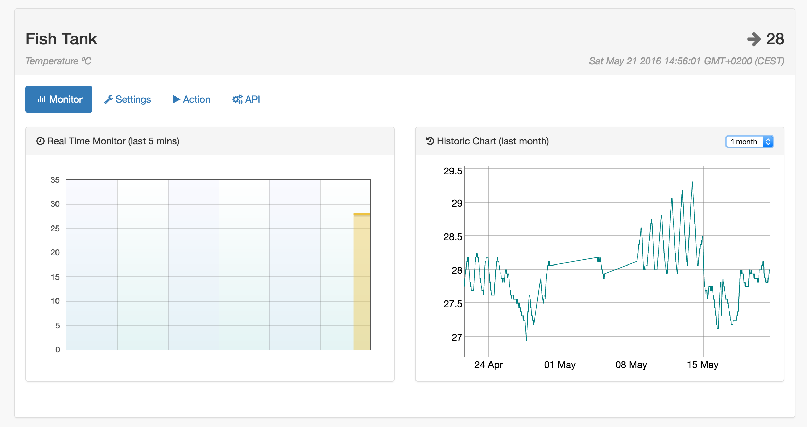
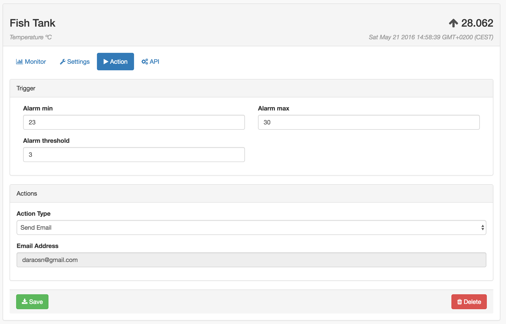
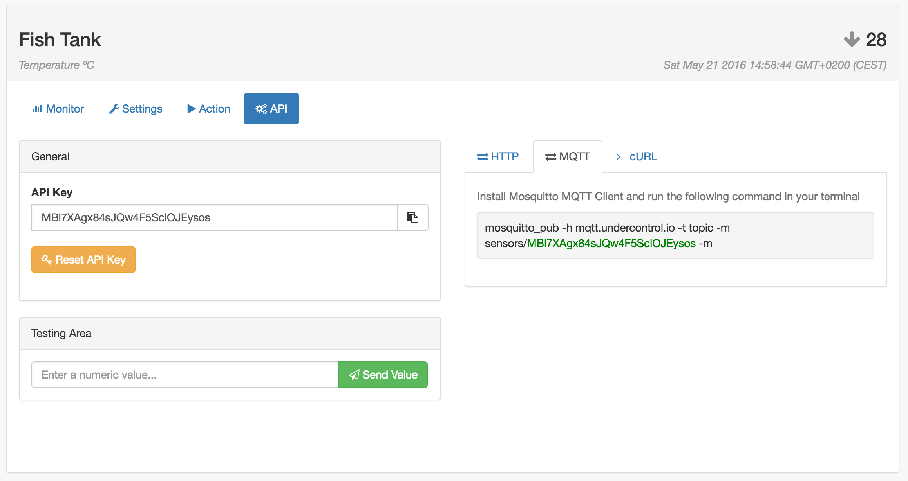

Undercontrol
================

Open Source realtime Internet of Things Platform with MQTT and Web-sockets support.

See it in action at: http://platform.undercontrol.io

Project homepage: http://undercontrol.io

ESP8266 Arduino Library: https://github.com/undercontrol-io/sdk-esp8266-arduino

MQTT Server: https://github.com/daraosn/undercontrol-mqtt

Features
--------

- Simple graphic interface

- Set alarms and triggers

- MQTT Support

Ruby on Rails
-------------

This application requires:

- Ruby 2.3.0
- Rails 4.2.5.1
- MySQL Server
- Pusher or similar (for web-sockets)
- MQTT Server (https://github.com/daraosn/undercontrol-mqtt)

MQTT
----

You can use Mosquito or your own implementation. Undercontrol is currently using a node service, if you feel lazy you can use my implementation at `mqtt.undercontrol.io`, it uses `mosca` npm (sorry for dirtiness, it's pretty stable though):

https://github.com/daraosn/undercontrol-mqtt

Problems? Issues? Collaborate?
------------------------------

Feel free to open a Github issue. For special inquiries you can also contact me at diego@undercontrol.io

Author
------

Diego Araos <diego@undercontrol.io>

Contributors
------------

Rodolfo del Valle <rodolfo@undercontrol.io>

MIT License
-----------

Copyright (c) 2016 Diego Araos <diego@undercontrol.io>

Permission is hereby granted, free of charge, to any person obtaining a copy of this software and associated documentation files (the "Software"), to deal in the Software without restriction, including without limitation the rights to use, copy, modify, merge, publish, distribute, sublicense, and/or sell copies of the Software, and to permit persons to whom the Software is furnished to do so, subject to the following conditions:

The above copyright notice and this permission notice shall be included in all copies or substantial portions of the Software.

THE SOFTWARE IS PROVIDED "AS IS", WITHOUT WARRANTY OF ANY KIND, EXPRESS OR IMPLIED, INCLUDING BUT NOT LIMITED TO THE WARRANTIES OF MERCHANTABILITY, FITNESS FOR A PARTICULAR PURPOSE AND NONINFRINGEMENT. IN NO EVENT SHALL THE AUTHORS OR COPYRIGHT HOLDERS BE LIABLE FOR ANY CLAIM, DAMAGES OR OTHER LIABILITY, WHETHER IN AN ACTION OF CONTRACT, TORT OR OTHERWISE, ARISING FROM, OUT OF OR IN CONNECTION WITH THE SOFTWARE OR THE USE OR OTHER DEALINGS IN THE SOFTWARE.
